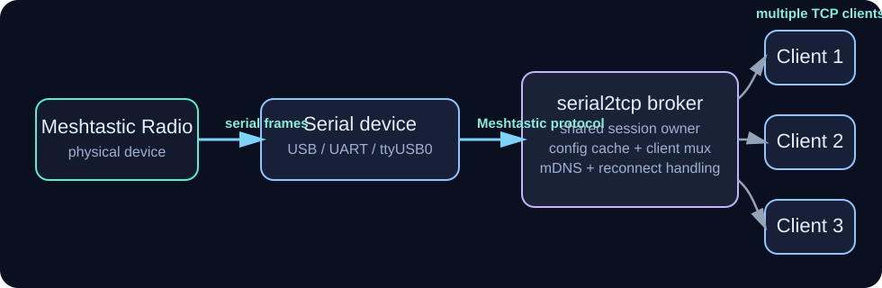
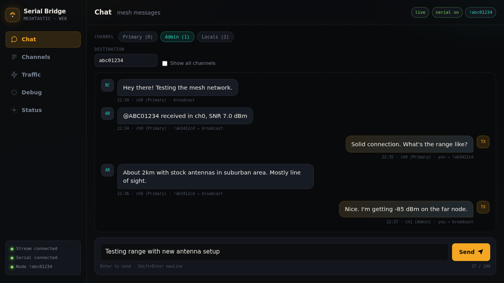
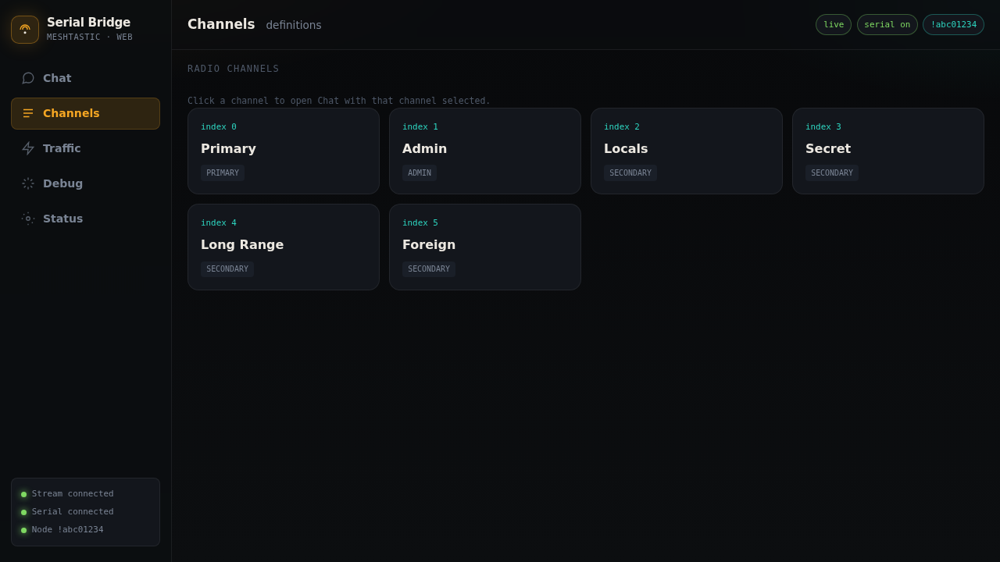

# go-meshtastic-serial2tcp
[](https://goreportcard.com/report/github.com/skrashevich/go-meshtastic-serial2tcp)
[](LICENSE)
[](https://pkg.go.dev/github.com/skrashevich/go-meshtastic-serial2tcp)
[](https://github.com/skrashevich/go-meshtastic-serial2tcp/releases)
[](https://dawnl.ink/skrashevich/go-meshtastic-serial2tcp/workflows/release/main)


[Русская версия](README.ru.md)

`go-meshtastic-serial2tcp` is a Go-based TCP-to-serial bridge for Meshtastic radios.

It exposes a Meshtastic device connected over USB or another serial interface as a TCP service, so desktop apps, scripts, containers, or remote tools can talk to the radio without owning the serial port directly.

Unlike a naive serial forwarder, this bridge is designed for **multi-client Meshtastic access**: it keeps a single broker-owned phone↔radio session, multiplexes frames to multiple TCP clients, caches config responses, and avoids common reconnect and `want_config_id` conflicts between clients.

## Highlights

- **Meshtastic TCP bridge** for radios connected over a serial port
- **Multi-client access** with one shared broker session to the radio
- **Config caching** to reduce client contention and reconnect churn
- **mDNS discovery** for easier discovery on the local network
- **Docker-ready** deployment for servers, Raspberry Pi setups, and containerized environments
- Written in **Go**, with generated protobuf support for Meshtastic frames

## Typical use cases

- **Connect multiple desktop clients to one Meshtastic radio** without letting them fight over a single serial device.
- **Expose a USB-connected Meshtastic node to Docker containers** or other isolated services that should not access the serial port directly.
- **Share one radio across tools on a LAN**, including local apps, remote scripts, and containerized workloads.
- **Avoid serial-port contention** when several clients need read access, config access, or packet visibility at the same time.

## Why not a simple serial forwarder?

A simple serial forwarder can expose bytes over TCP, but it usually does not understand Meshtastic session behavior. That becomes painful as soon as more than one client is involved.

This bridge is built specifically for Meshtastic and adds the pieces a plain forwarder normally lacks:

- **Multi-client behavior** with one broker-owned phone↔radio session
- **Config caching** so repeated `want_config_id` requests do not constantly reset state
- **Reconnect resilience** when the radio reports `rebooted` or clients disconnect unpredictably
- **Broker-owned session control** so one client does not accidentally tear down the radio state for everyone else

In short: a simple forwarder passes bytes, while this service tries to preserve a stable Meshtastic session for multiple clients.

## Architecture



The broker sits between the physical Meshtastic radio and multiple TCP clients. It owns the serial connection, maintains shared state, and exposes the radio as one coordinated TCP service.

## Web UI (v0.2.0+)

Starting with **v0.2.0**, the bridge includes an optional built-in web interface for sending and receiving mesh messages, browsing channels, and monitoring radio activity.


*Chat interface - send and receive mesh messages in real-time*


*Channel browser - list and navigate radio channels, each with role and index*

Enable it with the `--webui` flag or `WEBUI_ENABLED=true` environment variable:

```bash
meshtastic-serial2tcp \
  --device /dev/ttyUSB0 \
  --baud 115200 \
  --tcp-port 4403 \
  --webui \
  --webui-addr :8080
```

Open `http://<host>:8080` in any browser. The UI connects to the bridge via Server-Sent Events for real-time chat, packet traffic, and debug logs.

## FAQ

### Why not `ser2net`?

`ser2net` is a good general-purpose serial-over-network tool, but it treats the connection as a byte stream. Meshtastic clients are more sensitive than that: they expect stable session behavior, config exchange, and predictable reconnect handling. `go-meshtastic-serial2tcp` understands those patterns and is designed to keep multiple Meshtastic clients from stepping on each other.

### Why not `socat`?

`socat` is excellent for quick plumbing, testing, and one-off forwarding. It is much less useful when several Meshtastic clients need to share one radio over time. It does not provide broker-owned session logic, config caching, or Meshtastic-specific reconnect handling.

### Why not direct USB passthrough?

Direct USB passthrough is fine when exactly one process owns the radio and everything runs on the same machine. It becomes awkward when you want to:

- share one radio across several apps,
- expose the radio to containers,
- connect from another machine on the LAN,
- avoid serial-device ownership conflicts.

This project exists for those cases.

## Requirements

### Runtime
- Access to the serial device (for example `/dev/ttyUSB0` on Linux or `/dev/tty.usb*` on macOS)

### Building from source
- Go 1.26+
- Git (to clone the repository with submodules)

### Development (optional, for regenerating protobuf files)
- `protoc` - Protocol Buffers compiler
- `protoc-gen-go` v1.36.11+ - Go protobuf code generator
- `make` - GNU Make (for using Makefile commands)

## Install and run (local)

Install with `go install`:

```bash
go install github.com/skrashevich/go-meshtastic-serial2tcp@latest
```

Run with flags:

```bash
meshtastic-serial2tcp \
  --device /dev/ttyUSB0 \
  --baud 115200 \
  --tcp-port 4403
```

Run with environment variables:

```bash
SERIAL_DEVICE=/dev/ttyUSB0 \
BAUD_RATE=115200 \
TCP_PORT=4403 \
meshtastic-serial2tcp
```

If you get a permission error for the serial device, make sure your user has access to it (for example, add your user to the `dialout` group on Linux or run with elevated permissions).


## Docker

Run a prebuilt image from GitHub Container Registry:

```bash
docker run --rm \
  --device /dev/ttyUSB0 \
  -p 4403:4403 \
  -e SERIAL_DEVICE=/dev/ttyUSB0 \
  -e BAUD_RATE=115200 \
  -e TCP_PORT=4403 \
  ghcr.io/skrashevich/go-meshtastic-serial2tcp:latest
```

Using docker-compose:

```yaml
services:
  meshtastic-serial2tcp:
    image: ghcr.io/skrashevich/go-meshtastic-serial2tcp:latest
    container_name: meshtastic-serial2tcp
    restart: unless-stopped
    environment:
      SERIAL_DEVICE: /dev/ttyUSB0
      BAUD_RATE: "115200"
      TCP_PORT: "4403"
    # Expose the TCP bridge to the host
    ports:
      - "4403:4403/tcp"
    privileged: true
    devices:
      - /dev/ttyUSB0:/dev/ttyUSB0
```

With Web UI enabled:

```bash
docker run --rm \
  --device /dev/ttyUSB0 \
  -p 4403:4403 \
  -p 8080:8080 \
  -e SERIAL_DEVICE=/dev/ttyUSB0 \
  -e BAUD_RATE=115200 \
  -e TCP_PORT=4403 \
  -e WEBUI_ENABLED=true \
  -e WEBUI_ADDR=:8080 \
  ghcr.io/skrashevich/go-meshtastic-serial2tcp:latest
```

Notes:

- For mDNS on Linux, you may need `--network host` so multicast announcements reach your LAN. If not required, set `-e MDNS_ENABLED=false`.
- If the container can't open the serial device, ensure the device is passed through and that permissions allow access.


## Configuration

Environment variables (and matching flags):

- `SERIAL_DEVICE` (default: `/dev/ttyUSB0`) -> `--device`
- `BAUD_RATE` (default: `115200`) -> `--baud`
- `TCP_PORT` (default: `4403`) -> `--tcp-port`
- `RECONNECT_DELAY` (default: `5`, seconds) -> `--reconnect-delay`
- `MDNS_ENABLED` (default: `true`) -> `--mdns`
- `READ_ONLY_CLIENTS` (default: `false`) -> `--read-only-clients` - when `true`, only the primary client may transmit; secondary clients still receive broadcasts and cached config.
- `SERVICE_NAME` (default: `Meshtastic Serial Bridge (<device>)`) -> `--service-name`
- `WEBUI_ENABLED` (default: `false`) -> `--webui`
- `WEBUI_ADDR` (default: `:8080`) -> `--webui-addr`
- `DEBUG` (default: `false`) -> `--debug` or `-D`

Healthcheck:

- `--healthcheck` exits with code 0 if the TCP port is reachable on `127.0.0.1`.

Debug logging:

- Enable with `DEBUG=true`, `--debug`, or `-D` for protobuf JSON on the wire plus `[config]` lines tracing `WantConfigId`, `ConfigCompleteId`, cache hits/misses, and nonce rewriting (useful for handshake debugging; noisy).

## mDNS discovery

When enabled, the service advertises `_meshtastic._tcp.local.` with details about the serial device and baud rate. If mDNS is not needed or doesn't work in your environment, disable it with `MDNS_ENABLED=false` or `--mdns=false`.

## Multi-client behavior

The broker holds the single phone↔radio session and multiplexes it across all TCP clients. Key semantics:

- **Primary client.** The first client to connect is tracked as primary (used for ordering). If it disconnects, any remaining client is promoted automatically.
- **`want_config_id` is cache-first.** A client's `want_config_id` is answered from the broker's cache whenever the cache is populated - for both primary and secondary clients. Only a cold start (empty cache) or a post-`rebooted` reset forwards the request to the radio, with a broker-owned nonce. This avoids a loop where every client's `want_config_id` triggered a firmware `rebooted=true` reply that dropped the client before the cache ever filled.
- **`FromRadio.rebooted=true` is absorbed.** The broker clears its cache and re-issues any in-flight config requests with fresh nonces. The `rebooted` frame is never forwarded to clients, because some client libraries treat it as a teardown signal.
- **`ToRadio.disconnect` is never forwarded.** The radio session outlives individual TCP clients; forwarding per-client disconnects used to make the firmware reset phone state and reboot on the next `want_config_id`.
- **Outgoing packets are echoed.** When a client transmits a packet (and `READ_ONLY_CLIENTS=false`, or the sender is primary), the packet is forwarded to the radio and mirrored as a `FromRadio` to *other* connected clients so their UIs stay in sync.
- **Slow clients are dropped.** `FromRadio` broadcasts use a bounded per-client buffer; a client that can't keep up is disconnected rather than silently losing frames.
- **Recoverable frame errors.** Invalid frame lengths on the serial link (`ErrInvalidFrame`) are logged and the reader resyncs on the next magic-byte pair instead of tearing down the broker.

## Development

### Building from source

Clone the repository with submodules:

```bash
git clone --recurse-submodules https://github.com/skrashevich/go-meshtastic-serial2tcp.git
cd go-meshtastic-serial2tcp
```

If you already cloned without submodules, initialize them:

```bash
git submodule update --init --recursive
```

Build the project:

```bash
go build -o go-meshtastic-serial2tcp .
```

Or using Makefile:

```bash
make build
```

### Protobuf generation

The project uses Protocol Buffers definitions from the official [Meshtastic protobufs](https://github.com/meshtastic/protobufs) repository (included as a git submodule in [protobufs/](protobufs/)).

#### Requirements

- `protoc` (Protocol Buffers compiler) - [Installation guide](https://grpc.io/docs/protoc-installation/)
- `protoc-gen-go` v1.36.11 or later:
  ```bash
  go install google.golang.org/protobuf/cmd/protoc-gen-go@v1.36.11
  ```

#### Regenerating protobuf files

Using Makefile (recommended):

```bash
# Check tools and versions
make tools-check

# Regenerate all protobuf files
make proto

# Update protobufs submodule to latest version
make proto-update

# Clean generated files
make proto-clean

# See all available commands
make help
```

Manual generation:

```bash
# Create temporary directory for generation
mkdir -p github.com/meshtastic/go/generated

# Generate from proto files
protoc \
  --proto_path=protobufs \
  --go_out=. \
  protobufs/meshtastic/*.proto protobufs/nanopb.proto

# Move generated files to the correct location
mkdir -p internal/meshtastic
mv github.com/meshtastic/go/generated/*.pb.go internal/meshtastic/
rm -rf github.com
```

The generated files use `package generated` and are placed in [internal/meshtastic/](internal/meshtastic/).
